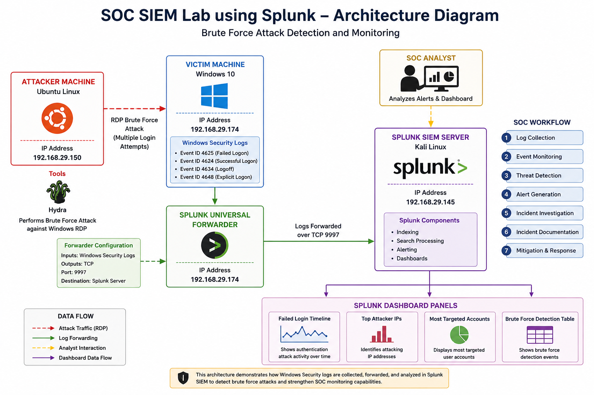
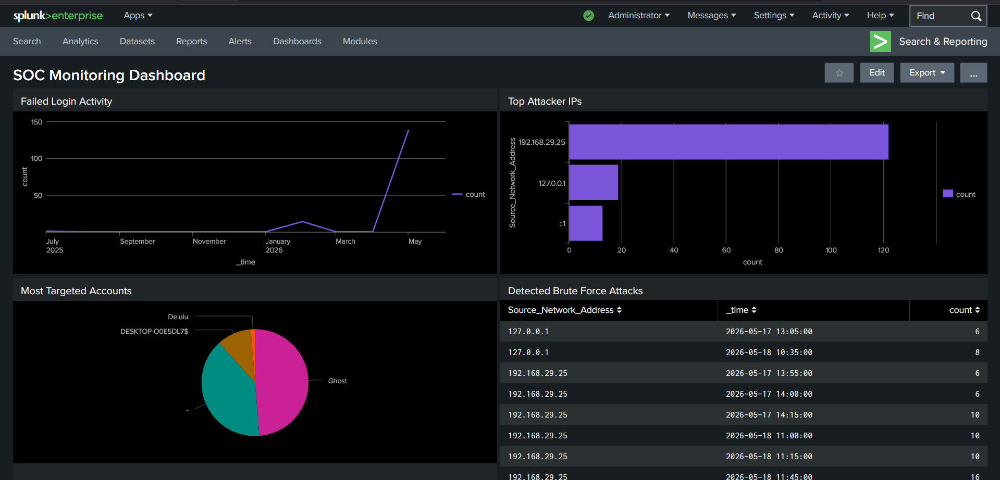
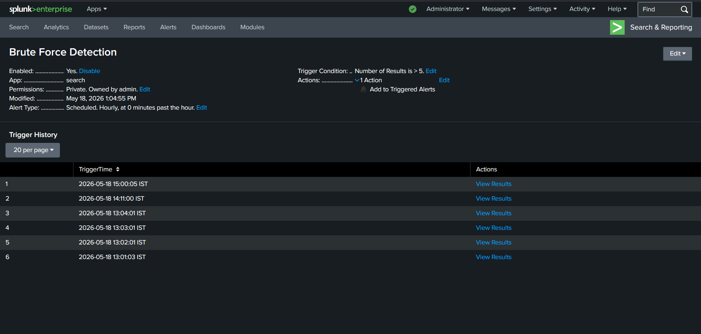
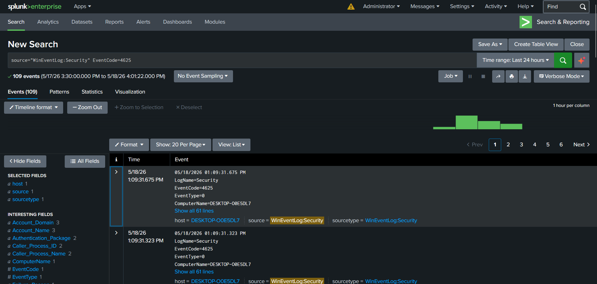
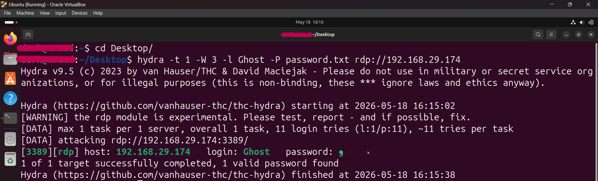
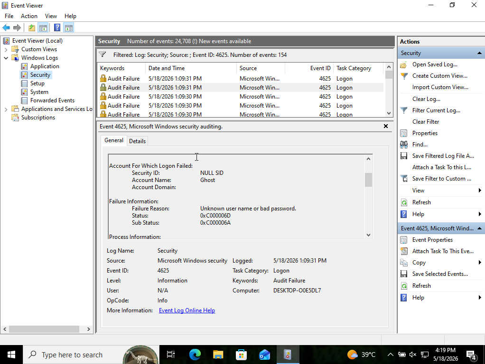

# SOC SIEM Lab using Splunk


##  Project Overview

This project demonstrates the implementation of a Security Operations Center (SOC) Lab using Splunk SIEM for centralized log monitoring, brute-force attack detection, alert generation, dashboard visualization, and incident investigation.

The lab simulates a real-world SOC environment where Windows Security logs are collected and analyzed to identify suspicious authentication activity generated through brute-force attack simulation using Hydra.

This project demonstrates practical SOC analyst skills including:

- SIEM deployment
- Windows log collection
- Security event monitoring
- Threat detection
- Brute-force attack detection
- Alert engineering
- Dashboard visualization
- Security investigation
- Incident response documentation

---

#  Project Objectives

The main objectives of this project are:

- Configure Splunk as a SIEM platform
- Collect Windows Security logs using Splunk Universal Forwarder
- Simulate brute-force attacks against Windows RDP
- Detect failed login attempts using SIEM correlation rules
- Generate real-time alerts
- Build monitoring dashboards
- Perform SOC investigation workflow
- Document incident response procedures

---

#  Lab Architecture

## Architecture Diagram



```text
Ubuntu Linux (Attacker Machine)
            ↓
Windows 10 Victim Machine
            ↓
Splunk Universal Forwarder
            ↓
Kali Linux Splunk SIEM Server
```

---

#  Lab Environment

| Machine | Purpose |
|---|---|
| Kali Linux | Splunk SIEM Server |
| Windows 10 | Victim Machine |
| Ubuntu Linux | Attacker Machine |

---

#  Network Configuration

All virtual machines were configured using Bridged Adapter networking to allow communication between systems.

Example IP Configuration:

| Device | IP Address |
|---|---|
| Kali Linux | 192.168.29.145 |
| Windows 10 | 192.168.29.174 |
| Ubuntu Linux | 192.168.29.150 |

---

#  Technologies Used

| Technology | Purpose |
|---|---|
| Splunk Enterprise | SIEM Platform |
| Splunk Universal Forwarder | Log Collection |
| Kali Linux | SIEM Server |
| Ubuntu Linux | Attack Simulation |
| Windows 10 | Victim Machine |
| Hydra | Brute-force Simulation |
| RDP Protocol | Remote Authentication Service |

---

#  Splunk Configuration

## Splunk Enterprise Installation

Splunk Enterprise was installed on Kali Linux.

Access URL:

```text
http://<KALI-IP>:8000
```

---

## Splunk Receiving Port Configuration

The receiving port was enabled in Splunk for log forwarding.

Path:

```text
Settings → Forwarding and Receiving → Receive Data
```

Enabled Port:

```text
9997
```

---

#  Windows Log Collection Configuration

## Splunk Universal Forwarder Installation

Splunk Universal Forwarder was installed on the Windows 10 machine for log forwarding.

---

## inputs.conf Configuration

```ini
[WinEventLog://Security]
disabled = 0
```

Purpose:
- Collect Windows Security Event Logs

---

## outputs.conf Configuration

```ini
[tcpout]
defaultGroup = default-autolb-group

[tcpout:default-autolb-group]
server = <KALI-IP>:9997
```

Purpose:
- Forward logs to Splunk SIEM server

---

#  Windows Audit Policy Configuration

The following audit policies were enabled:

| Policy | Configuration |
|---|---|
| Audit Logon Events | Success + Failure |
| Audit Credential Validation | Success + Failure |
| Audit Account Lockout | Success + Failure |

Purpose:
- Generate Windows authentication logs

---

#  Attack Simulation

## Objective

To simulate brute-force login attempts against a Windows RDP service for SIEM monitoring and threat detection.

---

## Test User Creation

The following test user was created on Windows:

```cmd
net user Ghost Password123 /add
```

---

## Password List

A custom password list was created containing weak passwords:

```text
123456
password
admin
Password123
welcome
qwerty
```

---

## Hydra Installation

Hydra was installed on Ubuntu Linux:

```bash
sudo apt install hydra -y
```

---

## Brute Force Attack Command

```bash
hydra -t 1 -W 3 -l Ghost -P password.txt rdp://192.168.29.174
```

### Command Explanation

| Option | Description |
|---|---|
| -t 1 | Single connection thread |
| -W 3 | Wait 3 seconds between attempts |
| -l Ghost | Target username |
| -P password.txt | Password wordlist |
| rdp:// | Attack protocol |

---

#  Log Verification

Windows Security logs were successfully detected in Splunk using:

```spl
source="WinEventLog:Security"
```

Failed login events were verified using:

```spl
source="WinEventLog:Security" EventCode=4625
```

---

#  Important Windows Event IDs

| Event ID | Description |
|---|---|
| 4625 | Failed Login Attempt |
| 4624 | Successful Login |
| 4634 | User Logoff |

---

#  SOC Investigation Workflow

The investigation process followed a standard SOC workflow:

1. Log Collection
2. Event Monitoring
3. Threat Detection
4. Alert Generation
5. Incident Investigation
6. Incident Documentation
7. Mitigation Recommendations

---

#  Detection Queries

## 1. Failed Login Detection

```spl
source="WinEventLog:Security" EventCode=4625
```

Purpose:
- Detect all failed login attempts

---

## 2. Top Attacker IP Detection

```spl
source="WinEventLog:Security" EventCode=4625
| stats count by Source_Network_Address
| sort -count
```

Purpose:
- Identify attacker IP addresses generating authentication failures

---

## 3. Most Targeted Accounts

```spl
source="WinEventLog:Security" EventCode=4625
| stats count by Account_Name
| sort -count
```

Purpose:
- Identify heavily targeted accounts

---

## 4. Failed Login Timeline

```spl
source="WinEventLog:Security" EventCode=4625
| timechart count
```

Purpose:
- Visualize authentication attack activity over time

---

## 5. Brute Force Detection Rule

```spl
source="WinEventLog:Security" EventCode=4625
| bucket span=5m _time
| stats count by Source_Network_Address,_time
| where count > 5
```

### Detection Logic

- More than 5 failed logins
- From same source IP
- Within 5 minutes

Purpose:
- Detect brute-force attack behavior

---

# 🚨 Alert Configuration

## Alert Name

```text
Brute Force Detection Alert
```

---

## Alert Settings

| Setting | Value |
|---|---|
| Trigger Condition | Number of Results > 0 |
| Severity | High |
| Schedule | Every 5 Minutes |

---

#  Dashboard Development

A SOC Monitoring Dashboard was created in Splunk containing the following panels:

| Dashboard Panel | Purpose |
|---|---|
| Failed Login Timeline | Monitor login attack trends |
| Top Attacker IPs | Identify attacker systems |
| Most Targeted Accounts | Detect targeted users |
| Brute Force Detection Table | View detected brute-force events |

---

#  Proof of Concept (PoC)

The following screenshots demonstrate the successful implementation of the SOC SIEM Lab, including attack simulation, log collection, threat detection, dashboard monitoring, and incident investigation.

## Dashboard



---

## Brute Force Alert



---

## Failed Login Logs



---

## Hydra Attack Simulation



---

## Windows Event Viewer



---

#  Sample Security Log

Example Windows failed login event:

```text
LogName=Security
EventCode=4625
Account_Name=Ghost
Source_Network_Address=192.168.29.150
Failure_Reason=Unknown user name or bad password
```

---

#  MITRE ATT&CK Mapping

| Technique ID | Technique |
|---|---|
| T1110 | Brute Force |
| T1021 | Remote Services |

---

#  Incident Investigation Summary

## Incident Type

Brute Force Authentication Attack

---

## Detection Method

Repeated failed login attempts were detected from the same source IP address using Splunk SIEM correlation rules.

---

## Indicators of Compromise (IOCs)

| Indicator | Value |
|---|---|
| Source IP Address | 192.168.29.150 |
| Target System | Windows 10 |
| Target User | Ghost |
| Event ID | 4625 |
| Attack Method | Brute Force |

---

## Investigation Findings

The investigation identified repeated failed authentication attempts against the Windows 10 RDP service originating from the Ubuntu attacker machine.

The attack generated multiple EventCode 4625 logs within a short time period, matching brute-force attack behavior.

Splunk SIEM successfully:

- Collected Windows Security logs
- Detected suspicious authentication activity
- Generated brute-force alerts
- Visualized attacker activity through dashboards

---

## Impact Assessment

Potential risks associated with this attack include:

- Unauthorized system access
- Credential compromise
- Lateral movement
- Privilege escalation
- Data exposure

The attack was conducted in a controlled lab environment and no actual compromise occurred.

---

## Mitigation Recommendations

### Immediate Actions

- Block suspicious IP addresses
- Disable unused RDP services
- Monitor failed login activity

---

### Security Hardening

- Enable account lockout policy
- Enforce strong password policies
- Restrict RDP access
- Use firewall rules
- Enable multi-factor authentication

---

### Monitoring Improvements

- Configure additional SIEM alerts
- Monitor successful logins after repeated failures
- Implement endpoint monitoring
- Integrate Sysmon logs

---

# 📁 Project Structure

```text
SOC-SIEM-Lab-using-Splunk/
│
├── README.md
├── LICENSE
├── incident_report.md
├── architecture_diagram.png
│
├── screenshots/
│   ├── dashboard.png
│   ├── brute_force_alert.png
│   ├── failed_login_logs.png
│   ├── hydra_attack.png
│   ├── windows_event_viewer.png
│
├── queries/
│   ├── failed_logins.spl
│   ├── brute_force_detection.spl
│   ├── top_attacker_ips.spl
│   ├── targeted_accounts.spl
│   ├── login_activity_timeline.spl
│
├── configs/
│   ├── windows_inputs.conf
│   ├── windows_outputs.conf
│
├── logs/
│   ├── sample_security_log.txt
│
└── documentation/
    ├── setup_guide.md
    ├── attack_simulation.md
    ├── detection_logic.md
```

---

#  Skills Demonstrated

- SIEM Deployment
- Windows Log Collection
- Security Monitoring
- Threat Detection
- Brute Force Detection
- Alert Engineering
- Dashboard Development
- Security Investigation
- Incident Response
- Log Analysis
- SOC Operations

---

# 🚀 Future Improvements

Potential enhancements for future development:

- Sysmon integration
- GeoIP attacker mapping
- Email alert notifications
- Linux SSH attack detection
- Malware detection use cases
- MITRE ATT&CK dashboards
- Endpoint monitoring integration

---

# 👨‍💻 Author

Prakash

---

# 📜 License

This project is licensed under the MIT License.